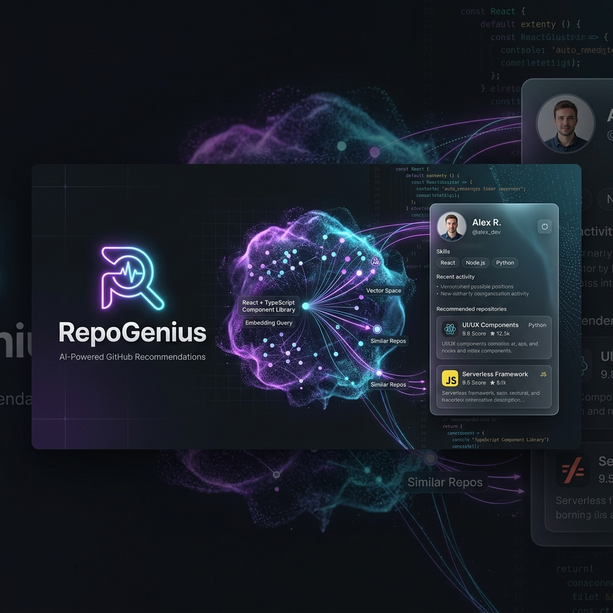
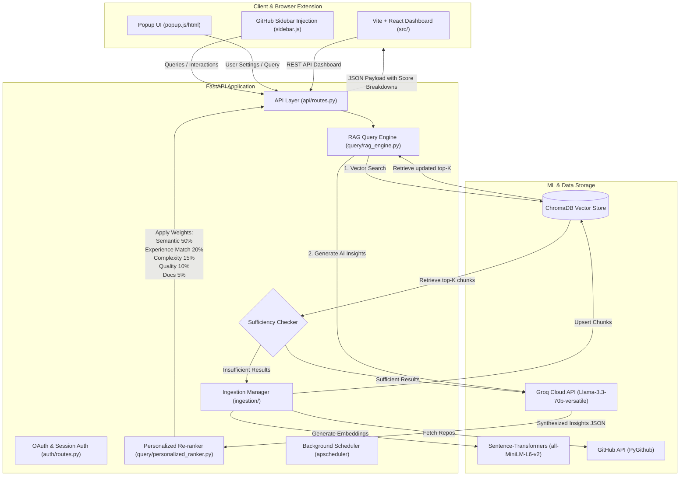

# <p align="center"></p>

# <p align="center">🧬 RepoGenius 🧬</p>
### <p align="center">**AI-Powered & Personalized GitHub Repository Discovery Engine**</p>

<p align="center">
  
  
  
  
  
  
</p>

---

## 🌟 Introduction

**RepoGenius** is a state-of-the-art AI-powered search, recommendation, and re-ranking engine designed to help developers discover the perfect open-source repositories on GitHub. By combining natural language semantic search (RAG), on-demand repository crawling (auto-ingestion), custom developer profiling, and explainable AI scoring, RepoGenius simplifies discovery and tailors it specifically to your skills and goals.

The system features:
1.  **FastAPI Backend**: Orchestrates semantic query processing, JWT-based user authentication, and ingestion scheduling.
2.  **React Dashboard**: A premium, responsive interface for interactive search and profile management.
3.  **Manifest V3 Chrome Extension**: A companion that injects interactive sidebars directly into GitHub pages to provide instant insights and log interactions.

---

## ✨ Key Features

*   **🔍 Semantic Search & RAG**: Query repositories using natural language (e.g., *"a high-performance microservice starter kit using Redis and Postgres"*) instead of relying on exact keyword tags.
*   **⚡ On-the-Fly GitHub Auto-Ingestion**: If search relevance or result density drops below sufficiency thresholds, RepoGenius automatically queries the GitHub Search API, crawls candidates, filters for code quality, chunks, embeds, and indexes them in real-time.
*   **🧠 Multi-Factor Profile Re-Ranking**: Personalize results using your experience level, preferred languages, complexity preference, and project goals (e.g., learning, hackathons, production).
*   **📊 Explainable AI (XAI) Score Breakdowns**: Understand recommendations immediately with detailed mathematical score breakdowns and a human-readable checklist explaining suitability.
*   **🧩 Chrome Extension Companion**: Integrates directly into GitHub Search and repository pages. Adds sidebar panels showing AI insights (advantages, limitations, best use cases) and tracks interactions (views, saves, stars) to refine recommendations.
*   **🔑 Google & GitHub OAuth 2.0**: Secure authentication utilizing HttpOnly cookies with JWT session state.

---

## 📐 System Architecture



---

## 📂 Project Structure

```text
RepoGenius/
├── backend/                  # FastAPI Application
│   ├── api/                  # Core API routes & Pydantic models
│   │   ├── models.py         # Schemas for requests/responses
│   │   └── routes.py         # Query, status, health, and ingestion routes
│   ├── auth/                 # OAuth authentication (Google & GitHub)
│   │   ├── jwt_handler.py    # Session signing & token validation
│   │   └── routes.py         # Redirect handlers & cookie state managers
│   ├── ingestion/            # Pipeline to fetch and process GitHub repos
│   │   ├── chunker.py        # Code and readme text splitting
│   │   ├── content_extractor.py # File contents parser
│   │   ├── embedder.py       # Embeddings generator (all-MiniLM-L6-v2)
│   │   ├── github_fetcher.py # GitHub search API fetcher
│   │   ├── quality_filter.py # Filters repos by stars, forks & activity
│   │   ├── scheduler.py      # Background worker for cron updates
│   │   └── vector_store.py   # ChromaDB client wrapper
│   ├── query/                # Search, ranking, and RAG services
│   │   ├── auto_ingestion.py # Triggers synchronous crawls on demand
│   │   ├── llm_client.py     # Groq API client with local program fallbacks
│   │   ├── personalized_ranker.py # Multi-factor re-ranking formula
│   │   └── rag_engine.py     # Orchestrator of the retrieval-generation loop
│   ├── config.py             # App environment configurations
│   └── main.py               # FastAPI entry point
│
├── extension/                # Chrome Extension (Manifest V3)
│   ├── background.js         # Service worker for API syncs & OAuth exchanges
│   ├── content.css           # Styling for sidebar & overlay widgets
│   ├── manifest.json         # Extension permissions & entry declarations
│   ├── popup.html / js / css # Toolbar popup & onboarding form
│   └── sidebar.js            # GitHub page DOM injector & UI controller
│
├── src/                      # Frontend Application (React 19 + Vite + TS)
│   ├── components/           # UI elements (Cards, search bar, profile forms)
│   ├── contexts/             # Global contexts (Auth, Theme)
│   └── App.tsx               # Primary dashboard layout
│
├── chroma_db/                # Local Chroma Vector DB files (git-ignored)
├── requirements.txt          # Python dependencies
└── package.json              # NPM scripts and Node dependencies
```

---

## 🛠️ Tech Stack

*   **Backend**: Python, FastAPI, Uvicorn, APScheduler, PyGithub, Pydantic v2
*   **Vector DB & Embeddings**: ChromaDB, Sentence-Transformers (`all-MiniLM-L6-v2`)
*   **LLM API**: Groq (Llama-3.3-70b-versatile)
*   **Frontend**: React (v19), TypeScript, Vite, Tailwind CSS (v4)
*   **Chrome Extension**: Manifest V3, JavaScript, Vanilla CSS, Content Scripts, Background Service Worker

---

## 📊 Re-Ranking Weight Formula

Recommendations are re-sorted dynamically based on your developer profile. The personalized score ($S$) is calculated as follows:

$$S = 0.50 \cdot S_{\text{semantic}} + 0.20 \cdot S_{\text{experience\_match}} + 0.15 \cdot S_{\text{complexity\_fit}} + 0.10 \cdot S_{\text{repo\_quality}} + 0.05 \cdot S_{\text{documentation\_quality}}$$

| Metric | Weight | Description |
| :--- | :---: | :--- |
| **Semantic Similarity** ($S_{\text{semantic}}$) | 50% | Cosine similarity distance of the query embedding. |
| **Experience Match** ($S_{\text{experience\_match}}$)| 20% | Map of repository's target suitability against developer level. |
| **Complexity Fit** ($S_{\text{complexity}}$) | 15% | Star count boundaries and topic densities aligned with your profile choice. |
| **Repository Quality** ($S_{\text{quality}}$) | 10% | Logarithmic normalization of repository star/fork reputation. |
| **Documentation Quality** ($S_{\text{docs}}$) | 5% | Density of readme content, file structures, and topics. |

---

## ⚙️ Configuration & Environment Variables

Create a `.env` file in the root directory. You can use the following variables:

```env
# GitHub Token for Ingestion (PAT - Personal Access Token)
GITHUB_TOKEN=your_github_pat_here

# Groq API Key for LLM summary capabilities
GROQ_API_KEY=gsk_your_groq_key_here
GROQ_MODEL=llama-3.3-70b-versatile

# ChromaDB path
CHROMA_DB_PATH=./chroma_db

# Port and Host
HOST=0.0.0.0
PORT=8000

# Quality Ingestion Filters
MIN_STARS=50
MIN_FORKS=10
MAX_INACTIVITY_DAYS=730

# OAuth Configs (Google & GitHub)
GOOGLE_CLIENT_ID=your_google_client_id
GOOGLE_CLIENT_SECRET=your_google_client_secret
GITHUB_CLIENT_ID=your_github_client_id
GITHUB_CLIENT_SECRET=your_github_client_secret

# Session Keys
JWT_SECRET=your-secure-jwt-secret-string
FRONTEND_URL=http://localhost:5173
BACKEND_URL=http://127.0.0.1:8000
```

---

## 🏃 Setup & Execution

### 1. Backend Setup (FastAPI)

1.  Navigate to the repository and set up a Python virtual environment:
    ```bash
    python -m venv venv
    # Activate virtual environment
    # Windows:
    .\venv\Scripts\activate
    # macOS/Linux:
    source venv/bin/activate
    ```
2.  Install required dependencies:
    ```bash
    pip install -r requirements.txt
    ```
3.  Run the FastAPI backend:
    ```bash
    uvicorn backend.main:app --reload --host 127.0.0.1 --port 8000
    ```
    *The API docs will be available at [http://127.0.0.1:8000/docs](http://127.0.0.1:8000/docs)*.

### 2. Frontend Setup (React + Vite)

1.  Install Node.js dependencies in the root folder:
    ```bash
    npm install
    ```
2.  Run the Vite development server:
    ```bash
    npm run dev
    ```
3.  To build the frontend and output it directly to the backend's static directory (so it can be served as a single-origin application):
    ```bash
    npm run build
    ```

### 3. Loading the Chrome Extension

1.  Open Google Chrome and navigate to `chrome://extensions/`.
2.  Enable **Developer mode** (toggle in the top-right corner).
3.  Click **Load unpacked** in the top-left corner.
4.  Select the `extension` folder inside this repository.
5.  RepoGenius is now active! Open any page on [GitHub](https://github.com) or search results to see the sidebar injection, or click the extension logo in the Chrome toolbar for the popup search dashboard.

---

## 📡 API Reference

### 1. Natural Language Query
*   **Endpoint**: `POST /api/query`
*   **Description**: Retrieves standard recommendations from vector store.
*   **Payload**:
    ```json
    {
      "query": "REST API framework with type safety",
      "language": "Python",
      "topics": ["fastapi", "pydantic"],
      "n_results": 10
    }
    ```

### 2. Personalized Query
*   **Endpoint**: `POST /api/query/personalized`
*   **Description**: Retrieves recommendations, re-ranks them based on developer profile, and compiles explainable scoring.
*   **Payload**:
    ```json
    {
      "query": "machine learning python library",
      "user_profile": {
        "experience": "intermediate",
        "goal": "learning",
        "language": "Python",
        "languages": ["Python", "C++"],
        "complexity": "moderate",
        "project_types": ["AI / ML", "Data Science"]
      },
      "n_results": 20
    }
    ```

### 3. Track User Interactions
*   **Endpoint**: `POST /api/interactions`
*   **Description**: Logs a user click, save, or star action from the sidebar.
*   **Payload**:
    ```json
    {
      "repo": "fastapi/fastapi",
      "action": "saved",
      "query": "ASGI frameworks"
    }
    ```

### 4. Background Sync Health & Status
*   **Endpoint**: `GET /api/status`
*   **Description**: Returns current vector indices, scheduled tasks, and ingestion sync status.

*   **Endpoint**: `GET /api/health`
*   **Description**: Returns liveness check status, Chroma DB count, and models loaded.

---

## 🛡️ License

Distributed under the MIT License. Feel free to clone, modify, and raise Pull Requests!

---

<p align="center">Made with ❤️ by the RepoGenius Team</p>
