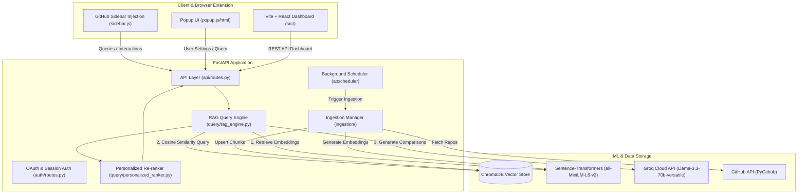

 🌌 RepoGenius — AI-Powered GitHub Repository Discovery

RepoGenius is a state-of-the-art recommendation engine and Chrome Extension designed to streamline developer discovery of GitHub repositories. By combining a **FastAPI semantic search backend** (backed by ChromaDB, Sentence-Transformers, and Groq's LLMs) with a **React-based user dashboard** and a **Manifest V3 Chrome Extension**, RepoGenius delivers highly personalized repository suggestions directly to your browser and GitHub interface.

---

## 🚀 Key Features

*   **🔍 Semantic Search & RAG**: Query repositories using natural language (e.g., *"lightweight web router in Rust"* or *"advanced React charts for dashboard"*) rather than exact keyword matches.
*   **⚖️ Personalized Scoring & Re-ranking**: Personalize results based on developer profiles (experience level, primary programming languages, and learning or deployment goals) using a weighted scoring model.
*   **🤖 AI-Powered Comparative Summaries**: Leveraging LLMs (via Groq Cloud) to summarize search results, pinpointing which recommendations are *best for beginners*, *best for learning*, and *best for scalability*.
*   **🔌 GitHub Sidebar Injection**: Injects a custom sidebar directly into GitHub pages (`https://github.com/*`) to search, save, and discover related repositories on the fly.
*   **🔄 Automated Ingestion & Scheduler**: An integrated background worker (via APScheduler) crawls GitHub APIs, filters repos by popularity/inactivity, embeds metadata, and indexes them into a vector store.
*   **📊 Developer Interaction Tracking**: Logs clicks, stars, and views to refine the developer recommendation loop.

---

## 🏗️ System Architecture



---

## 🛠️ Tech Stack

*   **Backend**: Python, FastAPI, Uvicorn, APScheduler, PyGithub, Pydantic v2
*   **Vector DB & Embeddings**: ChromaDB, Sentence-Transformers (`all-MiniLM-L6-v2`)
*   **LLM API**: Groq (Llama-3.3)
*   **Frontend**: React (v19), TypeScript, Vite, Tailwind CSS (v4)
*   **Chrome Extension**: Manifest V3, JavaScript, Vanilla CSS, Content Scripts, Background Service Worker

---

## ⚙️ Configuration & Environment Variables

Create a `.env` file in the root directory. You can use the following variables:

```env
# GitHub Token for Ingestion (PAT - Personal Access Token)
GITHUB_TOKEN=your_github_pat_here

# Groq API Key for LLM summary capabilities
GROQ_API_KEY=gsk_your_groq_key_here
GROQ_MODEL=llama-3.3-70b-versatile

# ChromaDB path
CHROMA_DB_PATH=./chroma_db

# Port and Host
HOST=0.0.0.0
PORT=8000

# Quality Ingestion Filters
MIN_STARS=50
MIN_FORKS=10
MAX_INACTIVITY_DAYS=730

# OAuth Configs (Google & GitHub)
GOOGLE_CLIENT_ID=your_google_client_id
GOOGLE_CLIENT_SECRET=your_google_client_secret
GITHUB_CLIENT_ID=your_github_client_id
GITHUB_CLIENT_SECRET=your_github_client_secret

# Session Keys
JWT_SECRET=your-secure-jwt-secret-string
FRONTEND_URL=http://localhost:5173
BACKEND_URL=http://127.0.0.1:8000
```

---

## 🏃 Setup & Execution

### 1. Backend Setup (FastAPI)

1.  Navigate to the repository and set up a Python virtual environment:
    ```bash
    python -m venv venv
    # Activate virtual environment
    # Windows:
    .\venv\Scripts\activate
    # macOS/Linux:
    source venv/bin/activate
    ```
2.  Install required dependencies:
    ```bash
    pip install -r requirements.txt
    ```
3.  Run the FastAPI backend:
    ```bash
    uvicorn backend.main:app --reload --host 127.0.0.1 --port 8000
    ```
    *The API docs will be available at [http://127.0.0.1:8000/docs](http://127.0.0.1:8000/docs)*.

### 2. Frontend Setup (React + Vite)

1.  Install Node.js dependencies in the root folder:
    ```bash
    npm install
    ```
2.  Run the Vite development server:
    ```bash
    npm run dev
    ```
3.  To build the frontend and output it directly to the backend's static directory (so it can be served as a single-origin application):
    ```bash
    npm run build
    ```

### 3. Loading the Chrome Extension

1.  Open Google Chrome and navigate to `chrome://extensions/`.
2.  Enable **Developer mode** (toggle in the top-right corner).
3.  Click **Load unpacked** in the top-left corner.
4.  Select the `extension` folder inside this repository.
5.  RepoGenius is now active! Open any page on [GitHub](https://github.com) or search results to see the sidebar injection, or click the extension logo in the Chrome toolbar for the popup search dashboard.

---

## 📡 Core API Endpoints

| Endpoint | Method | Description |
| :--- | :--- | :--- |
| `/api/health` | `GET` | System health check (Chroma DB count, loaded embedding models). |
| `/api/status` | `GET` | Status of background ingestion scheduler and indexing statistics. |
| `/api/query` | `POST` | Natural language semantic query for repos. |
| `/api/query/personalized` | `POST` | Re-ranked search queries utilizing user's developer profile. |
| `/api/interactions` | `POST` | Log client/extension user events (clicks, saves, stars). |
| `/api/ingest` | `POST` | Trigger repository crawling & embedding manually in the background. |

---

## 👥 Authors & License

Distributed under the MIT License. Feel free to clone, modify, and raise Pull Requests!
